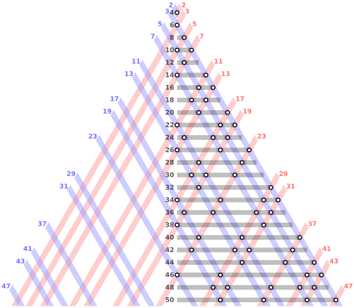

# Goldbach's conjecture

Goldbach's conjecture is one of the oldest and best-known unsolved problems in number theory and all of mathematics. It states:

**Every even integer greater than 2 can be expressed as the sum of two primes**

The conjecture has been shown to hold for all integers less than 4 × 10^18 ,but remains unproven despite considerable effort.

Goldbach partitions of the even integers from 4 to 50

for more detailed info [Click Here](https://en.wikipedia.org/wiki/Goldbach%27s_conjecture)
