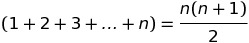

# Number System
---
## Numbers Categorization
```
Numbers
|-- Real
|   |-- rational
|   |   |-- fractions
|   |   |   |-- proper
|   |   |   |-- improper
|   |   |   |-- mixed
|   |   |   `-- compound
|   |   `-- Integers
|   |       |-- Whole
|   |       |   |-- Zero
|   |       |   `-- Positive/Natural
|   |       `-- Negative
|   `-- irrational
`-- Complex
```
Set of **Natural Numbers** is donated by **N**

---
## Even & Odd Numbers

### Even Numbers

*Divisible By 2 and gives 0 as a remainder*     
**Examples**: 2,14..etc           
**Unit Digit**:0,2,4,6,8

### Odd Numbers

*Not Divisible By 2 and gives 1 as a remainder*     
**Examples**: 3,17..etc           
**Unit Digit**:1,3,5,7,9

---
## Prime Numbers

Those **Natural Numbers** that have **exactly two factors** ,1 and number itself

Prime Numbers Can be represented as **** (it's not consistent in generating Prime numbers)

Bonus:[Goldbach's conjecture](Goldbachs_Conjecture.md)

---
## Unit Digit Usage & finding Unit Digit

### Unit Digit Usage In Addition

By using unit digit concept we can simplify calculation

For Example:
> 24 + 12 + 52=?
>
> 4+2+2=8
>
> 2+1+5=8
>
> 24 + 12 + 52 = 88

### finding Unit Digit

To understand the concept of unit digit, we must know the [concept of cyclicity](Cyclicity_of_Remainders.md) . This concept is mainly about the unit digit of a number and its repetitive pattern on being divided by a certain number


The concept of unit digit can be learned by figuring out the unit digits of all the single digit numbers from 0 - 9 when raised to certain powers.

These numbers can be broadly classified into three categories for this purpose:

**Digits 0, 1, 5 & 6**: When we observe the behaviour of these digits, they all have the same unit's digit as the number itself when raised to any power, i.e.  = 0,  =1,  = 5,  = 6. Let's apply this concept to the following example.

**Example**: Find the unit digit of following numbers:

>  = 5
>
> = 1
>
> = 6
>
> = 0

**Digits 4 & 9**: Both these numbers have a cyclicity of only two different digits as their unit's digit.

Let us take a look at how the powers of 4 operate:

> = 4
>
>  = 16
>
>  = 64, and so on.

Hence, the power cycle of 4 contains only 2 numbers 4 & 6, which appear in case of odd and even powers respectively.


Likewise, the powers of 9 operate as follows:
>  = 9
>
>  = 81
>
>  = 729, and so on.

Hence, the power cycle of 9 also contains only 2 numbers 9 & 1, which appear in case of odd and even powers respectively.

So, broadly these can be remembered in even and odd only, i.e.  = 4 and  = 6. Likewise,  = 9 and  = 1.

**Example**: Find the unit digit of following numbers:
>
>   = 9 (since power is odd)
>
>  = 1(since power is even)
>
>  = 4 (since power is odd)
>
>  = 6 (since power is even)

**Digits 2, 3, 7 & 8**: These numbers have a power cycle of 4 different numbers.

 = 2,  = 4,  = 8 &  = 16 and after that it starts repeating.

So, the cyclicity of 2 has 4 different numbers 2, 4, 8, 6.


 = 3,  = 9,  = 27 &  = 81 and after that it starts repeating.

So, the cyclicity of 3 has 4 different numbers 3, 9, 7, 1.

7 and 8 follow similar logic.

So these four digits i.e. 2, 3, 7 and 8 have a unit digit cyclicity of four steps.


### Cyclicity Table
Number|Cyclicity|	Power Cycle
--|---|--
1|1|1  
2|4|2,4,8,6  
3|4|3,9,7,1
4|2|4,6
5|1|5
6|4|6   
7|4|7,9,3,1
8|4|8,4,2,6  
9|2|9,1
10|1|0  


**Example 1**: Find the Unit digit of 

>Step 1: We know that the cyclicity of 7 is 4.

>Step 2: Divide the power 562581 by 4.

>By doing that, we get a remainder=1.

>Step 3: 1st power in the power cycle of 7 is 7.

>Hence, the answer is 7.

**Example 2**: Find the Unit digit of 13445 * 54336

>Cyclicity of 5 & 6 is 1.

>Since 5*6=30

>the unit digit of given expression is 0.


## Remainder Theorem

>**Dividend=(Divisor*Quotient )+Remainder**


## Divisibility Test's

### 2:
Number is divisible by 2 , if its unit digit is either 0,2,4,6 or 8.
### 3:
If sum of all digits is divisible by 3.
### 4:
If the number formed by the last two digits is divisible by 4.
### 5:
Number is divisible by 5 , if its unit digit is either 0 or 5.
### 6:
If the number is divisible by both 2 and 3 simultaneously.
### 7:
Remove the last digit, double it, subtract it from the truncated original number and continue doing this until only one digit remains. If this is 0 or 7, then the original number is divisible by 7. Example: 1603 -> 160-2(3)=154 -> 15-2(4)=7, so 1603 is divisible by 7.
### 8:
If the number formed by the last three digits is divisible by 8.
### 9:
If sum of all digits is divisible by 9.
### 11:
If the differnce of the sum of its digits at odd places and the sum of its digits at even places, is either 0 or a Number divisible by 11.

---
## Important Number Series

### Arithmetic Progression(AP)
A number series, which progress in such way that the differnce between  two consecutive number is common

**e.g:** 2 ,7 ,12 ,17 ,22...


> #### N th Term
>
>**Tn=a+(n-1)d**
>
>a=First term in the Series
>
>n=number of terms in the Series
>
>d=common differnce of the Series
>
>#### Sum of n Term
> ****


#### Important Results of an AP
1. Sum of n consecutive Numbers

  

2. Sum of squares of n consecutive natural numbers
  
3. Sum of cube n consecutive natural numbers
  


### Geometrical Progression(GP)
When ratio between two consecutive numbers is same.
costant ratio is known as common ratio.

**e.g:** 

**e.g:** 2 ,4 ,8 ,16....
> #### N th Term
>
>****
>
> Sum of n Term
>
> ****

---
## Factorisation
It's the Process of spliting any number into the form of its basic prime factors.

e.g 24=2x2x2x3=x3

---
## Important Formulae

1. 

2. 

3. 

4. 

5. 

6. 

7. 

8.  
